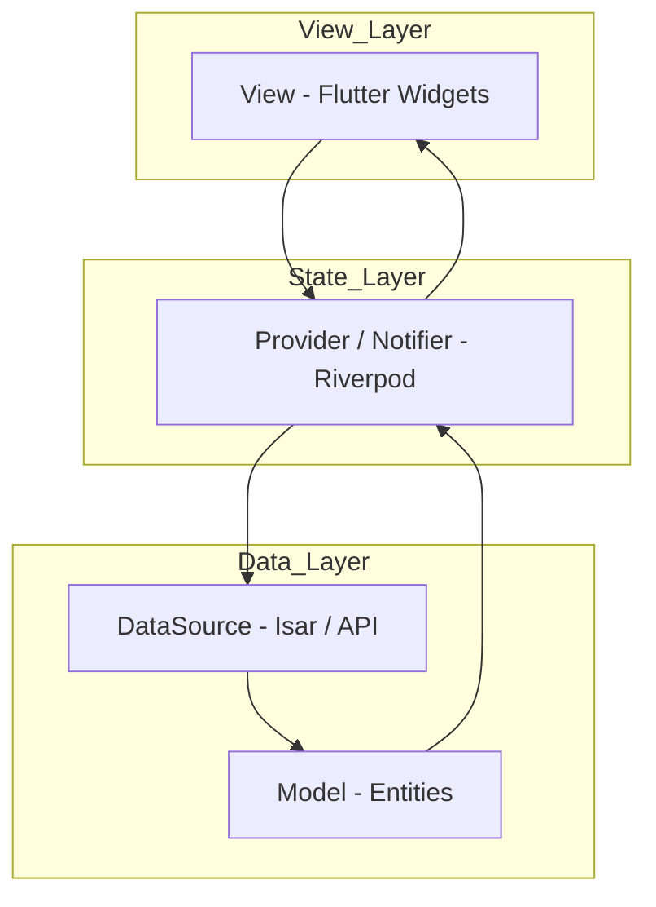

# Project Architecture Guide

This project follows a **Feature-first architecture** with **Riverpod** for state management. This structure ensures a strict separation of concerns, making the app highly testable and scalable.

## 1. Architectural Layers



---

## 2. Detailed Layer Breakdown

### View Layer (`lib/features/*/view`)
Handles everything the user sees and interacts with.
- **Views (`/view`)**: Pure Flutter widgets. They are "dumb" and only listen to state changes from providers.
- **Widgets (`/view/widgets`)**: Reusable UI components scoped to the feature.

### State Layer (`lib/features/*/data/providers`)
Manages business logic and UI state.
- **Providers / Notifiers**: Implemented using Riverpod `Notifier`. They manage UI state and handle user events by calling data sources directly.

### Data Layer (`lib/features/*/data`)
Handles data storage and retrieval.
- **DataSources**: Implementations for local (Isar) or remote (API) data operations.
- **Models**: Data transfer objects and entities.

---

## 3. Core Architectural Patterns

### Dependency Injection (DI)
Located in `lib/core/di/dependency_injection.dart`.
We use a centralized `DI` class powered by manual injection. This allows for:
- Easy access to core services from providers.
- Simple overriding of dependencies for testing.

### Unidirectional Data Flow
1. **User Action**: User interacts with the View.
2. **Intent**: View calls a method on the Notifier.
3. **Logic**: Notifier processes the action and calls DataSource.
4. **State**: Notifier updates its state based on the result.
5. **Rebuild**: View reacts to the new state and updates the UI.

---

## 4. Feature Structure

Each feature follows this convention:

```
lib/features/{feature_name}/
├── view/
│   ├── {feature_name}_view.dart
│   └── widgets/
└── data/
    ├── datasources/
    ├── models/
    ├── providers/
    └── entities/
```
